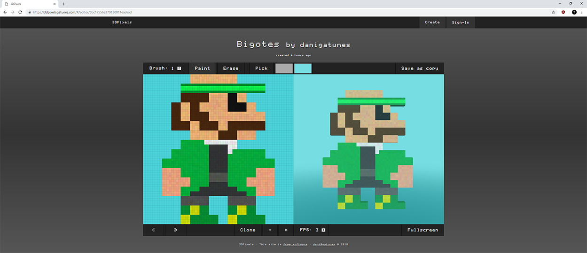

[3DPixels](https://3dpixels.gatunes.com/)
===

> A pixel art inspiration gallery

  <!-- Build Status -->
  
  <!-- Dependency Status -->
  
  <!-- devDependency Status -->
  

---

#### How do I start the dev server?

 * cd server  
 * yarn install
 * yarn start:dev

#### How do I start the dev client?

 * yarn install
 * yarn start

###### Note for MS Windows users:

> Your must have the "Create symbolic links" permission active in your user's Group Policy or the shared-git-hooks module install will fail. You can learn how to fix that: [Here](https://superuser.com/a/105381).

#### Can I analyze the client production bundle?

 * yarn build:report

#### How do I deploy the client to github pages?

 * Edit the config in [.env](.env).
 * yarn deploy

#### But can you automate that?

 * If you didn't already, Install travis-cli: `gem install travis`
 * Generate a new github personal access token: [Here](https://github.com/settings/tokens)
 * Run `travis encrypt GITHUB_TOKEN=your_gh_access_token` in the project root.
 * Replace the secure env in [.travis.yml](.travis.yml) with the output from travis-cli.
 * Log into [https://travis-ci.org](https://travis-ci.org) and enable your repo.
 * It will build and deploy the client bundle to github pages every time you push to master.

#### How do I deploy my own production server?

* cd server
* yarn docker:up
